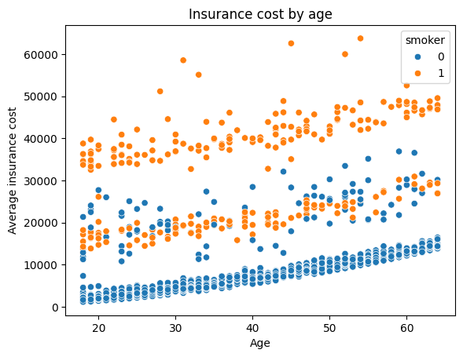
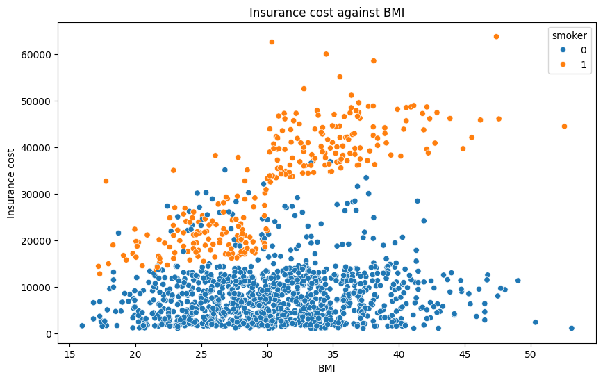

# US Medical Insurance Cost Analysis

**Predicting healthcare premiums for patients through a linear regression model by identifying key cost drivers and their interactions.**

## Project overview
Insurance companies need to be able to understand which patient factors drive up the cost of insurance and if there are particular combinations of traits that could considerably increase the cost for clients. Furthermore, being able to accurately predict what a patient should be charged allows for greater transparency with customers and decreases the probability of undercharging high risk patients and potentially incurring in losses.

## The data
The data for this Project was obtained through a publicly available Kaggle dataset on medical insurance costs in the US. The dataset can be accessed [here](https://www.kaggle.com/datasets/mirichoi0218/insurance). All the data is contained within a single file, insurance.csv, which can be found in the data folder of this project. The dataset included 7 columns:

| Feature | Description | Data type |
|:--- | :--- | :--- |
| age | Age of the patient | Integer |
| sex | Sex of the patient | String |
| bmi | BMI of the patient | Float |
| children | Number of children the patient has | Integer |
| smoker | Whether the patient smokes or not | Boolean |
| region | Region in which the patient lives | String |
| charges | Insurance premium | Float |

## Key insights
Several insights were derived from the analysis of the data, though one that particularly stood out is the cost multiplier effect of smoking. While all other traits are natural cost drivers, combining any of these factors with smoking generated a drastic increase in the insurance premium. This was particularly evident when looking at insurance premiums by age and by BMI and distinguishing between smokers and non-smokers.

*Figure 1: Comparison of charges by age, distinguishing between smokers and non-smokers.*

*Figure 2: Comparison of charges by BMI, distinguishing between smokers and non-smokers.*

After analyzing the data, a linear regression model was built to predict insurance costs for patients, the following determination coefficients were obtained:

**Training R^2:** 0.815

**Test R^2:** 0.877

The degree of fit of the model was later corroborated through a visual inspection of the predicted values against the actual values.

*Figure 3: Visual validation showing a strong linear fit.*

The full analysis, including the evaluation of the model, can be found [here](us-medical-insurance-costs.ipynb).

## How to explore this repository
**Analysis:** View the full the analysis in the [Jupyter Notebook](us-medical-insurance-costs.ipynb) for full EDA and modelling.

**Utilities:** Custom functions for plotting are in [util.py](util.py).

**Reproduction:** Run `pip install -r requirements.txt` to set up the environment.